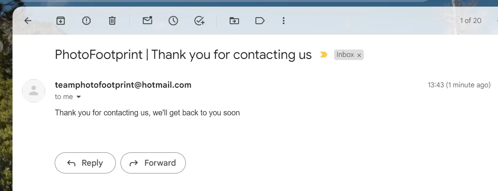
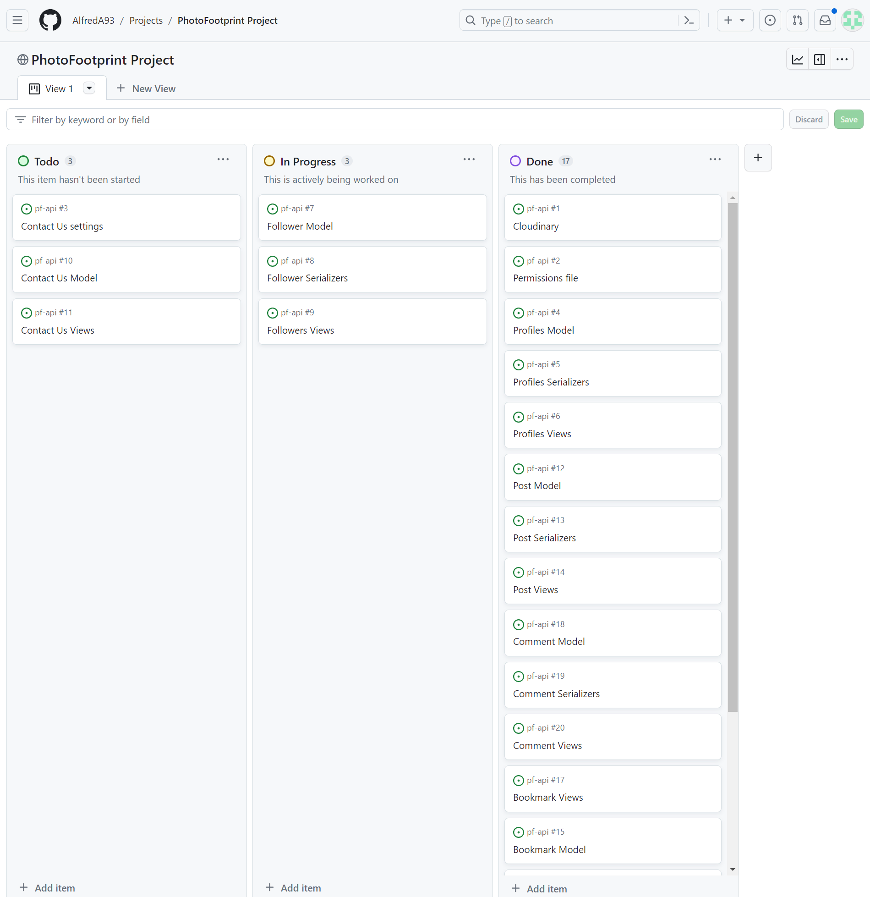
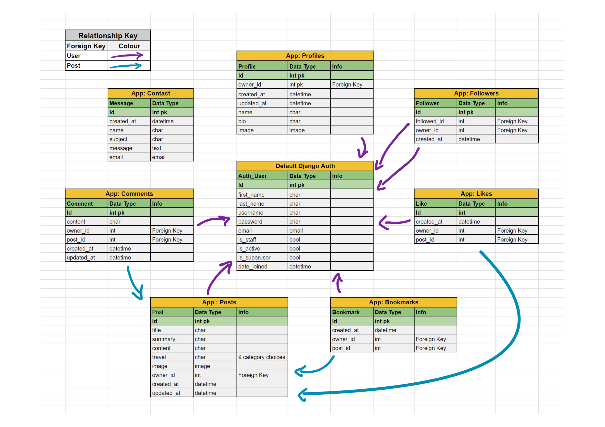

# PhotoFootprint
## Introduction
PhotoFootprint is a photo based social media platform for travellers. It's core goal is to help bring awareness to Eco friendly methods of transportation, allowing the community to share their own experiences easily and simply on the application. User's can upload posts which can be liked, bookmarked (saved) and commented on. User's can follow other user's to stay upto date with their friends and favourite travellers. 
## Contents
The README is split into 7 different parts - Overall Project Goals, Frontend, Backend, Deployment, Testing, Overall Learning Outcomes and Acknowledgements. These are all shown in the Contents list below. Testing is shown on a seperate markdown file linked within the Testing section below.

- [Overall Project Goals](#overall)
- [Frontend](#frontend)
  - [Design](#design)
    - [Agile](#agile)
    - [Project Goal](#project-fe)
    - [Scope](#scope-fe)
    - [Structure](#structure-fe)
    - [User Stories](#user-stories)
  - [Features](#features)
    - [Future Features](#future)
  - [Credits](#creds)
    - [Code](#code-fe)
    - [Helpsheets, Documentation and Useful Resources](#helpsheets)
  - [Techonology](#tech)
  - [Media](#media-fe)
- [Backend](#backend)
  - [Design](#design-be)
    - [Agile](#agile-be)
    - [Project Goal](#goals-be)
    - [Tasks](#tasks)
    - [Structure](#structure-be)
    - [ERD](#erd)
  - [Libraries Used](#libs-be)
  - [Credits](#cred-be)
    - [Code](#code-be)
    - [Helpsheets, Documentation and Useful Resources](#helps-be)
    - [Techonology](#tech-be)
    - [Media](#media-be)
- [Deployment](#deploy)
- [Testing](TESTING.md)
- [Overall Learning Outcomes](#outcomes)
- [Acknowledgements](#acknow)

# Overall Project Goals 
PhotoFootprint's overall goal is to help bring awareness to Eco friendly methods of transportation, allowing the community to share their own experiences easily and simply on the application. User's can upload posts which can be liked, bookmarked (saved) and commented on. User's can follow other user's to stay upto date with their friends and favourite travellers. The application will have a fully CRUD functional API with frontend that serves the API JSON data in a user friendly manner.
# Frontend 
The frontend of this project is a React JS application. The following subsections are all of the Design, Features & Credits of the frontend part of this project.
## Design 
### Agile 
I approached this project with an agile philosophy, applying the tools that GitHub offers to support this project. I set up a [PhotoFootprint GitHub Project](https://github.com/users/AlfredA93/projects/6), alongwith [Milestones](https://github.com/AlfredA93/pf-api/milestones) to help categorise the parts of the application that needed fulfilling. I applied labels of 'Could Have', 'Should Have' and 'Must Have' to give priority to the User Stories and Tasks needed to be fulfilled. For the frontend I implemented User Stories which are referenced [below.](#user-stories)

- GitHub Projects
    - 

- GitHub Milestones
    - 

### Project Goal 
The goal within the frontend part of this project is to create a frontend React application that enables users to share content within a photobased social media platform. The platform should request and respond to the backend API handling the JSON data it receives which is then presented in a user friendly manner. Users can add/edit and/or delete posts, comments, likes, bookmarks. Users can create and edit their account. Users can also fill in a form to contact the PhotoFootprint Team through simple form.

### Scope 
Our scope for this project is small and aims to cover the basic functionality of what a social media application needs, this is due to having a short timeframe to meet the deadline for this project. The project would be further developed upon post-production. 

The whole project needed to be fulfilled within 19 days, therefore the API would need to be finished within 5-6 days (realistically), to allow more time spent on the frontend React app (8-9 days), allowing a minimum of 3-4 days for README documentation to be fulfilled at the end. We needed to be flexible with the needs of the project due to the set deadline, which was why I applied labels of 'Could Have', 'Should Have' and 'Must Have' to give priority to the tasks set out in the [PhotoFootprint GitHub Project](https://github.com/users/AlfredA93/projects/6). This meant that we had the core functionality of what we needed, but also allowed us to be flexible and address any bugs or errors if/when they arose.

### Structure 
React is based on components. So within the display view, many components can make up the whole. See the [Features](#features) section for screenshots of the below components in action.
- Navigation Bar - This will feature throughout the entire site, staying consistent for the user.
- Most Followed Accounts - Most Followed Accounts section will appear on every page (except the add/edit post page), below the navbar (on mobile/small screen devices) or to the right of the post(s) (on larger screens/desktops).
- Post (when in Discover, Feed and Profile pages) - Each post will appear displaying the Image, Title, Travel Type and Summary, alongwith the Like icon and count, Comment Icon and count and the Bookmark Icon to save the bookmark. It will not display the main content of the post. On the Feed and Discover pages, the page has an Infinite Scroll feature that means more posts can be loaded without pagination (only if there are more than 10 posts on a page)
- Post (once clicked into the post or clicking on the comment button) - Within the individual post page, the Post will now include the main content of the post, where the owner of the post can write more content for their post.
- Comments - The comments section only appears on the individual post page, where users can now interact with the post and share their views with the owner of the post publically. This has Infinite Scroll, which loads older comments as you scroll down (only if there are more than 10 comments on a post).
- Edit Post Dropdown - This dropdown menu will display on each post where there are current logged in user is the owner of the post on screen.
- Edit Profile Dropdown - This dropdown menu allows the user to edit the profile details (username, password & bio) only if the current logged in user is the owner of the profile in view.
- Contact Us - This component is a button which enables a Modal to appear on screen when clicked. This allows the user to contact the PhotoFootprint Team if there is any questions, queries or feedback about the website. This is shown only if the current logged in user is the owner of the profile in view.
- Add/Edit Post - This is a standalone page where users can add or edit their posts. The Edit post page will automatically fill the fields with the current post data to be editted, for each of use.

### User Stories 

| Milestone |Title |Description	| Label |
|---------|------|-------------|-------|
|Nav Bar Front-End|User Story - Nav Bar |As a **user** I can **see the navbar consistently across all pages** so that **I can easily navigate around the site**|Must Have|
|Nav Bar Front-End|Page Routing|As a **user** I can **quickly switch between content** so that **I can see content change without having to refresh the page**|Must Have|
|Nav Bar Front-End|User Story - Account Sign Up|As a **user** I can **create an account** so that **I can join in the applications community and share my own posts/comments**|Must Have|
|Nav Bar Front-End|User Story - Account Sign In|As a **user** I can **sign in** so that **use the full functionality of the application**|Must Have|
|Nav Bar Front-End|User Story - Account Logged In|As a **user** I can **see my current logged in status** so that **log in or out if necessary**|Must Have|
|Nav Bar Front-End|User Story - Account - Refresh Tokens|As a **user** I can **stay logged in until i click log out** so that **I can come back to the site with more ease**|Must Have|
|Nav Bar Front-End|User Story - Nav Bar Conditional Rendering|As a **user** I can **see different navbar options depending if i’m logged in or not** so that **I can interact with the content or sign in/up if needed**|Must Have|
|Nav Bar Front-End|User Story - Profile Image|As a **user** I can **set a profile image** so that **it's easy to differentiate between users**|Must Have|
|Nav Bar Front-End|User Story - Contact Us|As a **user** I can **see a contact us button** so that **interact directly with the app team to ask any questions or share views**|Could Have|
|Creating, Liking & Bookmarking Posts Front-End|User Story - Create posts| As a **logged in user** I can **create posts** so that **join in with the community**|Must Have|
|Creating, Liking & Bookmarking Posts Front-End|User Story - View a post|As a **user** I can **click on a post to see a more detailed view of it** so that **learn more about it**|Must Have|
|Creating, Liking & Bookmarking Posts Front-End|User Story - Like a post|As a **logged in user** I can **like a post** so that **show which posts interest me**|Must Have|
|Creating, Liking & Bookmarking Posts Front-End|User Story - Bookmark a post|As a **logged in user** I can **bookmark a post** so that **save it to view later**|Should Have|
|The Posts (& Feed) Page(s) Front-End|User Story - View up to date posts|As a **user** I can **see the most recent posts first** so that **I can check on the latest posts**|Must Have|
|The Posts (& Feed) Page(s) Front-End|User Story - Search Filtering|As a **user**, I can **search through posts with a search bar**, so that **I can find specific posts**|Must Have|
|The Posts (& Feed) Page(s) Front-End|User Story - View bookmarked posts|As a logged in **user** I can **see posts that I have booked** so that **I have an area for saved posts**|Should Have|
|The Posts (& Feed) Page(s) Front-End|User Story - View Followed user posts|As a **logged in user** I can **see posts from users that I follow** so that **I can see their most recent posts easily**|Must Have|
|The Posts (& Feed) Page(s) Front-End|User Story - Infinite scroll|As a **user** I can **scroll through images easily and simply** so that **the website doesn’t need unnecessary interaction**|Must Have|
|The Post Page Front-End|User Story - Post page|As a **user** I can **view a post’s page** so that **read more about the post and comment on it**|Must Have|
|The Post Page Front-End|User Story - Edit/Delete post|As a **post owner** I can **delete/edit the details of the post** so that **I can have control over my content**|Must Have|
|The Post Page Front-End|User Story - Create comments|As a **logged in user** I can **comment on a post** so that **I can share my thoughts about the post**|Must Have|
|The Post Page Front-End|User Story - Comment timestamps|As a **user** I can **see a timestamp on each comment** so that **I can see how recent each comment was**|Must Have|
|The Post Page Front-End|User Story - View comments|As a **user** I can **read comments** so that **see what other users think**|Must Have|
|The Post Page Front-End|User Story - Delete comments|As a **comment owner** I can **delete a comment** so that **I can control my comments on posts**|Must Have|
|The Post Page Front-End|User Story - Edit comments|As a **comment owner** I can **edit my comment** so that **I can change it whenever I choose**|Must Have|
|The Profile Page Front-End|User Story - Profile page|As a **user** I can **see other user profiles** so that **see who uses the app**|Must Have|
|The Profile Page Front-End|User Story - Most followed profiles|As a **user** I can **see the most followed profiles** so that **I can see popular profiles**|Must Have|
|The Profile Page Front-End|User profile - stats|As a **user** I can **see user specific statistic about: bio, number of posts, followers and following** so that **I can learn more about them**|Must Have|
|The Profile Page Front-End|User Story - Follow/Unfollow a user|As a **logged in user** I can **follow/unfollow other users** so that **change my own content feed and keep up to date with the content I want**|Must Have|
|The Profile Page Front-End|User Story - See all posts by specific profile|As a **user** I can **see all posts created by specific profile** so that **interact with their content and/or follow/unfollow them**|Must Have|
|The Profile Page Front-End|User Story - Edit profile|As a **logged in user** I can **edit my own profile** so that **I can change my data when I choose to**|Must Have|
|The Profile Page Front-End|User Story - Update username and password|As a **logged in user** I can **update my login details** so that **keep my data secure and in my own control**|Must Have|

### Design Choices

#### Colors
- I used [ColorSpace](https://mycolor.space/?hex=%2300A000&sub=1) to help with color palette design. With the standout colors listed below
  - #00A000 Green
  - #3F4A3C Dark Grey with Green Hint
  - #00A847 Green
  - #14648D Pastel Blue
  - #F6EDD9 Cream
  - #00A6F3 Deep Sky Blue

#### Typography

The font [*Assistant*](https://fonts.google.com/specimen/Assistant) from GoogleFonts felt like the front that best matched the ethos of the [Overall Project Goals](#overall).

### Wireframes

- Add wireframes here

## Features 
- Navigation Bar
- Discover Page (Home Page)
- Feed
- Search Bar
- Saved (Bookmarked)
- Likes
- Sign Up
- Sign In
- Sign Out
- Add (add post)
- Edit Post
- Delete Post
- Comments
- Edit Profile
- Contact Us Modal
  - Contact Us Email
    - 

### Future Features 

- Add a map which shows the journey in where the user has travelled.
- Live Location Sharing (which city/country they're currently travelling through)
- Video upload
- Live video sharing

## Credits 
The code for the frontend of this project was inspired by the fantastic walkthrough project conducted by the [CodeInstitute]((https://codeinstitute.net/de/)) Team. The frontend React app called *Moments* (link to which is found in the Code section below) was the perfect grounding for PhotoFootprint to build on. 

### Code 
- Code Institute's [Moments](https://github.com/Code-Institute-Solutions/moments) code was used throughout the set up of this project. It was the prefect starting point for PhotoFootprint. Many of the core CRUD functions of the frontend between Moments and PhotoFootprint aligned, along with styling and composition. I editted, customised and added different buttons and styling to fit the specific needs of PhotoFootprint. 

### Helpsheets, Documentation and Useful Resources 
- [React Bootstrap Components](https://react-bootstrap-v4.netlify.app/components/)
- React Bootstrap - [Modal](https://react-bootstrap-v4.netlify.app/components/modal/) 

### Technology 
- [React](https://react.dev/learn)
- [ReactBootstrap](https://react-bootstrap-v4.netlify.app/)
- [ColorSpace](https://mycolor.space/?hex=%2300A000&sub=1) for color palette design 
- [Favicon creator](https://favicon.io/favicon-converter/)
- [Resize pixels](https://www.resizepixel.com/download) - used when resizing logo
- [Remove background](https://www.remove.bg/upload) in image - used for logo background removal 
### Media 
- All post images in the base content are from [Unsplash](https://unsplash.com/)
- Upload icon found on the Add post page and search icon found when no search results appear and on '404 Page Not Found' - [PNG Tree](https://pngtree.com/)
- Foot Icon in Logo	- [FreePik](https://freepik.com)

# Backend - PhotoFootprint API 
The backend of this project is a Django REST API application. The following subsections are all of the Design, Features & Credits of the backend part of this project.
## Design (backend) 
### Agile (backend) 
To manage the tasks and user stories on this project I used GitHub Projects. For the backend I wrote Milestones for each app, with issues (tasks) to be completed within each milestone, which could then be 'closed' when each was completed. Here is a link to the [PhotoFootprint GitHub Project](https://github.com/users/AlfredA93/projects/6) and [PhotoFootprint Milestones](https://github.com/AlfredA93/pf-api/milestones)
- The picture below is during the API phase of completion, when the Front End User Stories were yet to be added to the Project.
  - 

### Project Goal (backend) 
The goal of the backend API is to create a fully functional API which supplies data for a frontend react app. The admins will be able to post, update and delete posts/comments/likes/bookmarks and follows within the development environment of the API (when debug is set to True). Outside of the development environment, Users will be able to do the same from the frontend react app accessing the API which serves JSON data directly to the frontend. 

### Tasks 
| Milestone |Title |Description	| Label |
|---------|------|-------------|-------|
| PhotoFootprintAPI |Cloudinary | Add Cloudinary settings to settings.py| Must Have |
| PhotoFootprintAPI |Permissions file |	Create permissions file for IsOwnerOrReadOnly class used in serializer permission_classes |	Must Have |
| PhotoFootprintAPI | Contact settings | Add constants to settings.py that enable Contact Us App to function. | Could Have |
| Profiles API| Profiles Model | Create Profile model, related to Foreign Key User. Include image, bio, name, owner (FK), created_at, updated_at fields. | Must Have |
|Profiles API | Profiles Serializers | Create ProfileSerializer class with 'owner' as ReadOnlyField and 'is_owner' as SerializerMethodField	| Must Have |
|Profiles API | Profiles Views | Create ProfileList and ProfileDetail class views to show a list of profiles and the detailed profile respectively | Must Have |
|Followers API App | Follower Model | Create Follower Model with fields owner, followed and created_at. 'owner' with related_name 'following'. 'followed' with related_name 'followed' Both owner and followed are FK from User model. Include unique_together in the Meta class to help stop follow duplication | Must Have |
|Followers API App |Follower Serializers |Create FollowerSerializer class with 'owner' and 'followed_name'as ReadOnlyField(s). Add duplication validation |	Must Have |
|Followers API App|Followers Views |Create FollowerList and FollowerDetail views. Add permission_classes to only allow users to change their own follow data |Must Have |
|Contact API App |Contact Model| Create a Contact Model with name, email and message fields. Add save function and send_mail function from django.core.mail https://docs.djangoproject.com/en/3.2/topics/email/ |Could Have|
|Contact API App |Contact Views| Create ContactAPIView with basic post function. Add send_mail() function to view.	Could Have
|Contact API App|Contact Serializers| Create basic serializer to view all fields |Could Have |
|Posts API App|	Post Model| Create Post model, related to Foreign Key User. Include title, summary, content, travel, owner (FK), created_at, updated_at fields. Travel field should be a choice between the following options - Bicycle, Boat, By Foot, Combustion Engine Car, Electric Car, Multiple, Other, Plane, Train.	| Must Have |
|Posts API App|	Post Serializers|Create PostSerializer class with 'owner' as ReadOnlyField and 'is_owner' as SerializerMethodField. profile_id and profile_image as ReadOnlyField(s). Add image validation to the serializer, file size no larger than 2MB.|Must Have|
|Posts API App|Post Views|Create PostList and PostDetail class views to show a list of profiles and the detailed profile respectively. Use permission_classes to allow users to only update/delete their own posts. Add comment count, like count, filter and search capabilities to PostList|Must Have|
|Bookmarks API App|	Bookmark Model|	Create Bookmark Model with fields owner (FK - User), post (FK - Post) and created_at. 'post' with related_name 'bookmarks.' Include unique_together in the Meta class to help stop duplication|Should Have|
|Bookmarks API App|Bookmark Serializers|Create BookmarkSerializer class with 'owner' as ReadOnlyField. Add duplication validation|Should Have|
|Bookmarks API App|Bookmark Views|Create BookmarkList and BookmarkDetail views. Add permission_classes to only allow users to change their own follow data|Should Have|
|Comments API App|Comment Model	|Create Comment Model with fields, owner (FK - User), post (FK - Post), created_at, updated_at, content |Must Have|
|Comments API App|Comment Serializers|Create CommentSerializer and CommentDetailSerializer. CommentSerializer to have is_owner, created_at, updated_at as SerializerMethodField(s). Adjust updated_at and created_at to naturaltime. 'owner', 'profile_id' and 'profile_image' should be ReadOnlyField(s)|Must Have|
|Comments API App|Comment Views|Create CommentList and CommentDetail views. Add permission_classes to both to allow users to change only their own data. CommentList should have filter_backends and filterset_fields variables for data filtering|Must Have|
|Likes API App|	Like Model|Create Like Model with fields owner (FK - User), post (FK - Post) and created_at. 'post' with related_name 'likes.' Include unique_together in the Meta class to help stop duplication|Must Have|
|Likes API App|Like Serializers|Create LikeSerializer class with 'owner' as ReadOnlyField. Add duplication validation|Must Have|
|Likes API App|	Like Views|	Create LikeList and LikeDetail views. Add permission_classes to only allow users to change their own data|Must Have|

### Scope (backend) 
Our scope for this project is small and aims to cover the basic functionality of what a social media application needs, this is due to having a short timeframe to meet the deadline for this project. The project would be further developed upon post-production. 

The whole project needs to be fulfilled within 19 days, therefore the API would need to be finished within 5-6 days (realistically), to allow more time spent on the frontend React app (8-9 days), allowing a minimum of 3-4 days for README documentation to be fulfilled at the end. We needed to be flexible with the needs of the project due to the set deadline, which was why I applied labels of 'Could Have', 'Should Have' and 'Must Have' to give priority to the tasks set out in the [PhotoFootprint GitHub Project](https://github.com/users/AlfredA93/projects/6). This meant that we had the core functionality of what we needed, but also allowed us to be flexible and address any bugs or errors if/when they arose.

The API will have appropriate apps to fulfil the following tasks:
- CRUD functionality on Posts **(Must Have)**
- CRUD functionality on Comments **(Must Have)**
- Create, Read and Delete functionality on Likes **(Must Have)**
- Create, Read and Delete functionality on Followers **(Must Have)**
- Create, Read and Delete functionality on Bookmarks **(Should Have)**
- Create functionality on Contact Us form. **(Could Have)**

### Structure (backend) 
The structure of the API needed to be organised, so we could make sure that all the relationships between the models could be mapped before coding. Below in the [ERD](#erd) section, you can see the relationships between the models with the arrows.

- Post Model
    - owner (Foreign Key - from User model)
    - title - max length 100 characters
    - summary - max length 250 characters
    - content - text field
    - image - image field, default post image if user doesn't add image
    - travel - choice of 9 travels types: bicycle, boat, by foot, car, electric car, multiple, other, plane, train
    - created_at - datetime field
    - updated_at - datetime field
- Profile Model
    - owner (Foreign Key - from User model)
    - created_at - datetime field
    - updated_at - datetime field
    - name - max length 250 characters
    - bio - text field
    - image - image field, default post image if user doesn't add image
- Comment Model
    - owner (Foreign Key - from User model)
    - post (Foreign Key - from Post Model)
    - content - text field
    - created_at - datetime field
    - updated_at - datetime field
- Like Model
    - owner (Foreign Key - from User model)
    - post (Foreign Key - from Post Model)
    - created_at - datetime field
- Follower Model
    - owner (Foreign Key - from User model, related_name='following')
    - owner (Foreign Key - from User model, related_name='followed')
    - created_at - datetime field
- Bookmark Model
    - owner (Foreign Key - from User model)
    - post (Foreign Key - from Post Model)
    - created_at - datetime field
- Message Model
    - name - char field, max length 120 characters
    - email - email field
    - subject - char field, max length 120 characters
    - message - text field
    - created_at - datetime field

Filters - We need filters for the following:
- Posts filtered by bookmark and bookmark owner (for saved page)
- Posts filtered by title, travel, content and owner (for search bar)
- Posts filtered by owner (for profile page)
- Posts filtered by following (for feed page)

#### ERD 

## Features
The API's main features within this app are CRUD based. ie. Create, Read, Update and Destroy.
### Future Features
- Add a maps app and map model for setting post coordinates, so that users can store their journey's and share them on each post.
- Enable video and larger files to be uploaded.

## Libraries Used 
- Cloudinary - [`pip install cloudinary==1.34.0`](https://pypi.org/project/cloudinary/) - Cloud based image storage
- Django Database Url - [`pip install dj-database-url==0.5.0`](https://pypi.org/project/dj-database-url/0.5.0/) - Supporting cloud based database management
- Django REST Auth - [`pip install dj-rest-auth==2.1.9`](https://pypi.org/project/dj-rest-auth/2.1.9/) - Account authentication for Django REST
- Django v.3.2 - [`pip install Django==3.2.21`](https://pypi.org/project/Django/3.2.21/) - Django Framework
- Django AllAuth - [`pip install django-allauth==0.44.0`](https://pypi.org/project/django-allauth/0.44.0/) - Account authorisation 
- Django Cloudinary Storage - [`pip install django-cloudinary-storage==0.3.0`](https://pypi.org/project/django-cloudinary-storage/) - Supporting Cloudinary Image Storage
- Django CORS Headers - [`pip install django-cors-headers==4.2.0`](https://pypi.org/project/django-cors-headers/) - Support Cross Origin Resource Sharing
- Django Filter - [`pip install django-filter==23.3`](https://pypi.org/project/django-filter/) - Filtering database model fields
- Django REST Framework - [`pip install djangorestframework==3.14.0`](https://pypi.org/project/djangorestframework/) - Django REST Framework for backend data management
- Django REST Simple JSON Tokens - [`pip install djangorestframework-simplejwt==5.3.0`](https://pypi.org/project/djangorestframework-simplejwt/) - Encryption and decryption of JSON web tokens.
- Gunicorn - [`pip install gunicorn==21.2.0`](https://pypi.org/project/gunicorn/) - Supporting Deployment to Heroku
- Pillow - [`pip install Pillow==10.0.1`](https://pypi.org/project/Pillow/) - Supporting image processing 
- Psycopg2 - [`pip install psycopg2==2.9.7`](https://pypi.org/project/psycopg2/) - Supporting Deployment to Heroku

## Credits 
PhotoFootprint was inspired and supported by the brilliant walkthrough project conducted by the Team at [CodeInstitute](https://codeinstitute.net/de/). The API built in the *drf-api* walkthrough (linked below in **Code** section) was the perfect grounding for PhotoFootprint to set up from. 

### Code 
- Code Institute's [drf-api](https://github.com/Code-Institute-Solutions/drf-api) code was the basis for PhotoFootprint API. [drf-api](https://github.com/Code-Institute-Solutions/drf-api) was the perfect fit for what PhotoFootprint's goal was, so I editted, customised and added models and code to fit the specific needs of PhotoFootprint. 

### Helpsheets, Documentation and Useful Resources 
- [AbstractAPI - Django Send Email](https://www.abstractapi.com/guides/django-send-email): Brilliant helpsheet and tutorial for setting up Django `send_mail()` functionality.
- [Django send_mail documentation](https://docs.djangoproject.com/en/3.2/topics/email/)
- [Django REST Auth Documentation](https://dj-rest-auth.readthedocs.io/en/latest/installation.html)
- [Adding contents table to README file](https://community.atlassian.com/t5/Bitbucket-questions/How-to-write-a-table-of-contents-in-a-Readme-md/qaq-p/673363)

### Technology 
- [Cloudinary](www.cloudinary.com): For image storage
- [ElephantSQL](www.elephantsql.com): For database storage and management
- [Djecrety](https://djecrety.ir/): Django Secret Key Generator
- [Heroku](https://heroku.com): Heroku hosting platform.
- [Tiny Img](https://tiny-img.com/webp/) - convert png to webp images for README documentation screenshots.

### Media 
- Default Profile and Post images are from [CodeInstitute](https://codeinstitute.net/de/) [drf-api](https://github.com/Code-Institute-Solutions/drf-api) walkthrough learning materials.

## Deployment 

This project was deployed to Heroku. To prepare the backend for this we need to do the following.
- Create a `Procfile` at the top most directory of the code - this will be used my Heroku command line to know what to do with the code once the application is built. In this file the code below should be written on seperate lines
  - `release: python manage.py makemigrations && python manage.py migrate`
  - `web: gunicorn photofootapi.wsgi`
- Create a `requirements.txt` file. The easiest way to do this is once your code is ready for deployment type in the command when under the root directory `pip freeze > requirements.txt` and all the Python libraries will be added to the requirements.txt file, ready for Heroku to install all the dependancies.
- Create a runtime.txt file - This is used by Heroku to determine which version of Python to use to run the libraries within your application. Check the heroku support documentation to see which Python versions are still supported [here](https://devcenter.heroku.com/articles/python-support#specifying-a-python-version). I chose this version - `python-3.11.5`
- Build a production ready application in the IDE before deployment, so Heroku can deploy this will greater ease. Under the root directory, add a new `staticfiles` folder. Making sure to keep it case sensitive to `staticfiles`. Once this has been done. Type in the command `python manage.py collectstatic`. This will compile all the static files from the backend to the staticfolder. Now change directory into the frontend folder - `cd frontend` and type this code `npm run build && mv build ../staticfiles/.` This will build the react application and place all the necessary build files into a build folder and then move it into the staticfiles folder we previously created. If you need to make any future changes post deployment, use this following command to make changes to the latest build - `npm run build && rm -rf ../staticfiles/build && mv build ../staticfiles/.` 
- **Before deploying your production ready application you must set DEBUG = False within your IDE, so the site works as intended with any 404 pages working correctly. Once this change has been made, you can `push` the changes to your GitHub Repository** 
- Set up an account with Heroku, then follow these steps for deployment -
  - Create an app
  - Name the app
  - Connect the app to GitHub and find the repository.
  - Configure Variables - These are often the sensitive data variables that are needed to be kept secret from public sight. Head over to the settings tab and under the Config Vars sections, add the config vars appropriate to the app. In this case, it is ALLOWED_HOSTS, CLIENT_ORIGIN, CLOUDINARY_URL and DATABASE_URL, EMAIL_HOST_PASS, EMAIL_HOST_USER and SECRET_KEY. **Note: ALLOWED_HOSTS and CLIENT_ORIGIN will be almost identical. ALLOWED_HOSTS will be the url without `https://` and CLIENT_ORIGIN will have the full length url including `https://`, however excluding the final forward slash `/`**
    - 
  - Go to the Deploy tab and half way down the page you can choose to select automatic deploy (this is optional). When this is active, whenever a new edit is received by GitHub, Heroku also updates the application and builds a new deployment. I chose for this project not to automatically deploy with each `git push`. Click the deploy branch button at the bottom and await for completion. You will be alerted within the build console when the build and subsequent deployment is complete.

## [Testing](TESTING.md)
All testing and code validation is shown in the seperate [TESTING.md](TESTING.md) file.

# Overall Learning Outcomes 

# Acknowledgements 
